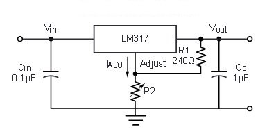

# LM317 resistor value calculator

## Overview

The LM317 is a versatile adjustable voltage regulator. (It can also be used as a current source,
but here we only discuss its use as a voltage regulator.)

In its most basic configuration, the LM317 is wired like this:

The output voltage is given by the formula: **V = 1.25 * (1 + R2 / R1)**

## Functionality

This Python script is prepopulated with a list of common resistor values, known in the industry
as E12. You may wish to edit the list to include any resistor values that are available to you,
but be aware of cost and production feasibility considerations.

The command to run the script is:

`./LM317_calculator.py` *target_voltage*

The output will be the base values of the resistors R1, R2 that should be used, along with the
actual output voltage that will be produced.

R1 should be in the order of magnitude in the range of 1K or less, so apply an appropriate
multiplier to the output values.
