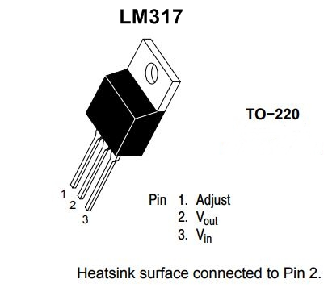

# LM317 resistor value calculator

## Overview

The LM317 is a versatile adjustable voltage regulator.

In its most basic configuration, the LM317 is wired like this:

The output voltage is given by the formula: **V_out = 1.25 * (1 + R2 / R1)**

The minimum differential is 3 volts between the input and the output. Therefore you must have **V_in >= V_out + 3**.

The LM317 has no maximum input voltage. However, the difference between the input and output voltage should not exceed 40V. There is a high-voltage version, the LM317HV, which allows an in-out voltage difference of up to 60V.

## Script usage

The script is prepopulated with a list of common resistor values, known in the industry
as E12. You may wish to edit the list to include any resistor values that are available to you,
but be aware of cost and production feasibility considerations.

The command to run the script is:

`./LM317_calculator.py` *target_voltage*

The output will be the values of the fixed resistors R1, R2 that should be used,along with the actual output voltage that will be produced.

You should have $$R1 >= 120$$. If this is not the case, you will get a warning.
